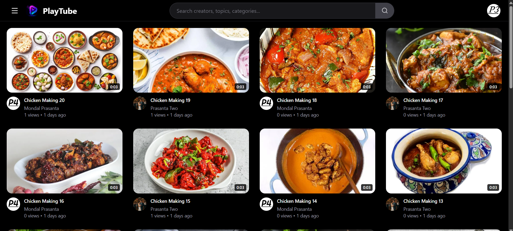
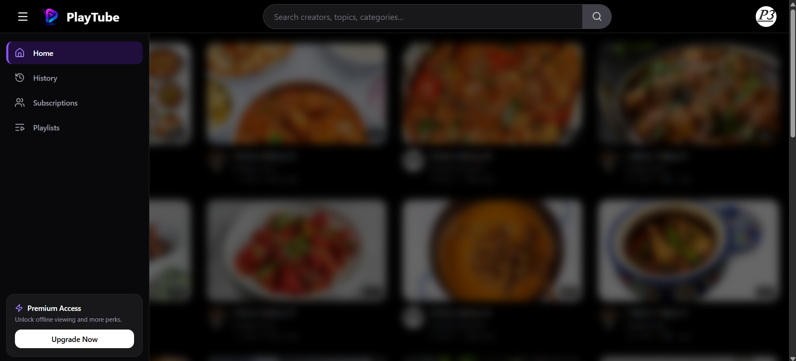
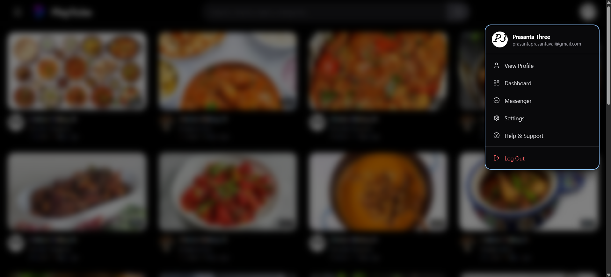
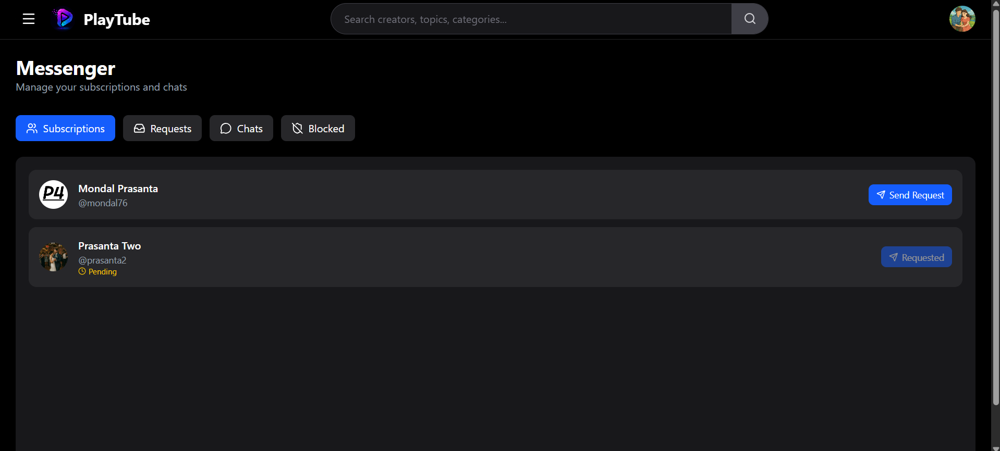
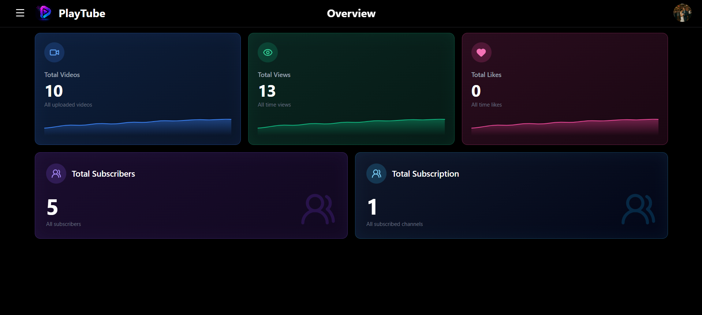
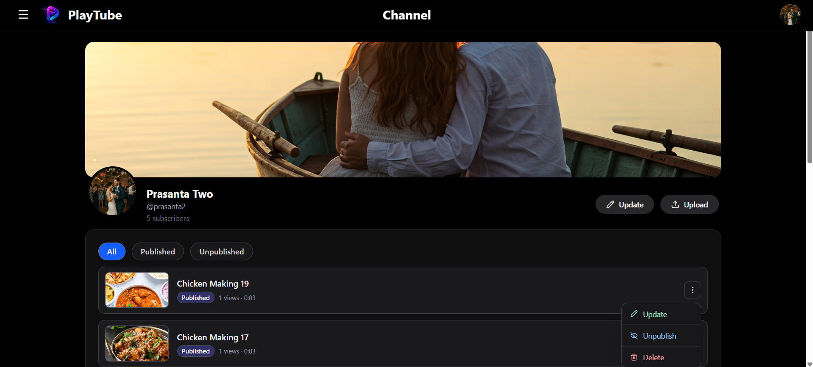
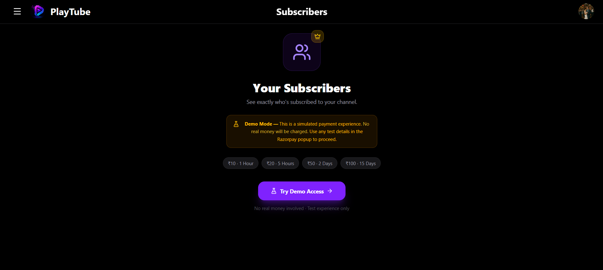

<div align="center">

<h1 align="center">
  
  PlayTube — Frontend
</h1>

**A modern, YouTube-inspired video streaming web app built with React and Vite.**

[](https://prasanta-mondal76-play-tube-fronten.vercel.app/)
[](https://react.dev/)
[](https://vitejs.dev/)
[](https://tailwindcss.com/)

🌐 **Live App:** [https://prasanta-mondal76-play-tube-fronten.vercel.app/](https://prasanta-mondal76-play-tube-fronten.vercel.app/)

</div>

---


## 📖 About

PlayTube is the client-side of a full-stack video sharing platform. Users can browse and watch videos, manage channels, interact through comments and likes, subscribe to creators, build playlists, track watch history, and chat in real time — all inside a responsive dark-themed UI.

This repository contains **only the frontend**. It connects to a separate backend API deployed on Render.

---
## 🖼️ Home Preview

<table>
  <tr>
    <td align="center">
      <br/>
      Home Page
    </td>
    <td align="center">
      <br/>
      Sidebar
    </td>
    <td align="center">
      <br/>
      Profile Menu
    </td>
  </tr>
</table>

---
## ✨ Features

### 🔐 Authentication
- Login and signup with a **two-step OTP verification** flow
- JWT-based session via HTTP-only cookies
- Persistent login state on app load
- Password strength validation during signup
- Forgot password and account deletion flows

### 🎥 Video Experience
- Home feed with paginated video grid
- Video player with watch page and suggested videos
- Search videos by keyword
- View count and like interactions
- Add videos to playlists from the watch page

### 👤 Channels & Profiles
- Public channel pages (`/profile/:username`)
- Subscribe / unsubscribe to channels
- Subscriptions feed for followed creators
- Avatar and cover image display

### 💬 Comments
- Comment on videos
- Edit and delete own comments
- Like comments

### 📋 Playlists & History
- Create and manage personal playlists
- Add / remove videos from playlists
- Watch history page for logged-in users

### 💌 Messenger
- Send chat requests to subscribed channels
- Accept or reject incoming requests
- Real-time messaging via **Socket.IO**
- Block and unblock users
- Tabbed UI: Subscriptions, Requests, Chats, Blocked


### 🖼️ Messenger Preview
 

### 📊 Creator Dashboard
- **Overview** — channel stats (views, likes, subscribers, videos)
- **Channel** — upload, update, publish/unpublish, and delete videos
- **Subscribers** — view subscriber list (gated behind Razorpay demo payment)

#### 🖼️ Dashboard Preview

<table>
  <tr>
    <td align="center">
      <br/>
      Overview
    </td>
    <td align="center">
      <br/>
      Channel Management
    </td>
    <td align="center">
      <br/>
      Subscribers & Payments
    </td>
  </tr>
</table>

### ⚙️ Settings
- Account, profile, and security settings
- Change password and update avatar / cover image
- Email change with OTP verification
- Watch history management
- Danger zone — request account deletion with email confirmation

### 🎨 UI / UX
- Dark theme throughout
- Mobile-friendly responsive layout
- Toast notifications via React Hot Toast
- Sidebar navigation with auth-aware menus

---

## 🛠️ Tech Stack

| Layer | Technology |
|---|---|
| Framework | React 19 |
| Build Tool | Vite 8 |
| Routing | React Router DOM v7 |
| Styling | Tailwind CSS v4 |
| HTTP Client | Axios (with credentials) |
| Real-time | Socket.IO Client |
| Notifications | React Hot Toast |
| Icons | Lucide React |

---

## 📂 Project Structure

```text
src/
├── assets/              # Static assets (logo, images)
├── components/
│   ├── auth/            # Login, signup, OTP forms
│   ├── comments/        # Comment section, cards, forms
│   ├── dashboard/       # Upload, update, delete video modals
│   ├── layout/          # Navbar, sidebar, dashboard nav
│   ├── messages/        # Messenger tabs, chat window, input
│   ├── user/            # Profile header, tabs, profile box
│   └── video/           # Video grid, player, cards, suggestions
├── context/
│   ├── LoginContextProvider.jsx   # Auth state
│   ├── SocketContextProvider.jsx  # Socket.IO connection
│   └── BoxContextProvider.jsx     # Modal / overlay state
├── layouts/
│   ├── MainLayout.jsx       # Public site shell
│   ├── DashboardLayout.jsx  # Creator dashboard shell
│   └── SettingsLayout.jsx   # Settings pages shell
├── pages/
│   ├── Home.jsx, VideoPlay.jsx, Profile.jsx, SearchResults.jsx
│   ├── History.jsx, Subscriptions.jsx, Playlist.jsx, Messenger.jsx
│   ├── dashboard/           # Overview, channel, subscribers
│   └── settings/            # Account, profile, security, etc.
├── routes/
│   └── AppRoutes.jsx        # All application routes
├── services/                # API modules (auth, video, comment, etc.)
├── utils/                   # Helpers and toast IDs
├── App.jsx
└── main.jsx
```

---

## 🗺️ Routes

| Route | Page |
|---|---|
| `/` | Home — video feed |
| `/watch/:videoId` | Video player and comments |
| `/profile/:username` | Channel profile |
| `/search` | Search results |
| `/history` | Watch history |
| `/subscriptions` | Subscribed channels |
| `/playlists` | User playlists |
| `/messenger` | Chat and requests |
| `/creator/dashboard/overview` | Creator stats |
| `/creator/dashboard/channel` | Manage videos |
| `/creator/dashboard/subscribers` | Subscriber list |
| `/settings/*` | Account settings |
| `/support` | Help and support |

---

## ⚙️ Environment Variables

Create a `.env` file in the project root:

```env
VITE_SOCKET_URL=https://your-backend-url.onrender.com
```

> `VITE_SOCKET_URL` is used as the base URL for both REST API calls (Axios) and the Socket.IO client.

---

## 📦 Installation

```bash
# Clone the repository
git clone https://github.com/Prasanta-Mondal76/play-tube-frontend.git

# Enter the project directory
cd play-tube-frontend

# Install dependencies
npm install
```

---

## 🏃 Running Locally

```bash
npm run dev
```

The app runs at **http://localhost:5173**

Make sure the backend is running and `VITE_SOCKET_URL` points to it (e.g. `http://localhost:4000`).

---

## 🔨 Build for Production

```bash
# Generate production build
npm run build

# Preview the production build locally
npm run preview
```

---

## 🚀 Deployment (Vercel)

This frontend is deployed on **Vercel**.

1. Import the repository into Vercel.
2. Set the environment variable:

   ```env
   VITE_SOCKET_URL=https://playtube-backend-puyh.onrender.com
   ```

3. Deploy. The included `vercel.json` handles SPA routing rewrites.

**Live deployment:** [https://prasanta-mondal76-play-tube-fronten.vercel.app/](https://prasanta-mondal76-play-tube-fronten.vercel.app/)

---

## 🔗 Related Repositories

| Resource | Link |
|---|---|
| Backend GitHub | [playtube-backend](https://github.com/Prasanta-Mondal76/playtube-backend) |
| Backend (Live API) | [https://playtube-backend-puyh.onrender.com](https://playtube-backend-puyh.onrender.com) |
| Frontend (Live App) | [https://prasanta-mondal76-play-tube-fronten.vercel.app/](https://prasanta-mondal76-play-tube-fronten.vercel.app/) |

---

## 👨‍💻 Author

**Prasanta Mondal**  
GitHub: [https://github.com/Prasanta-Mondal76](https://github.com/Prasanta-Mondal76)

---

## 📜 License

This project is created for learning, portfolio, and educational purposes.
